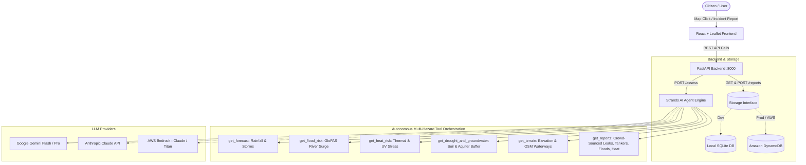

# Flood Agent 🌊
### Autonomous AI Waterlogging & Flood Risk Intelligence for ANY Location on Earth
**Environmental Hacks Hackathon (AWS / WeMakeDevs)**  
**Track:** Heat and Water | **Submission Deadline:** October 11, 2026  
**Built with:** AWS Strands Agents SDK, FastAPI, React, Leaflet, and Global Environmental APIs.

---

## 📌 What It Does

Flash floods and urban waterlogging threaten billions of people worldwide. Traditional flood alert systems are fragmented, localized to select wealthy municipalities, or buried in complex hydrological simulations that ordinary citizens cannot easily understand.

**Flood Agent** is an autonomous AI agent capable of assessing flood and waterlogging risks for **any geographic coordinate on Earth** (not hardcoded to any single city). 

When a user selects a location via map click, search, or device geolocation, the agent autonomously executes 4 specialized tools across free global APIs, correlates satellite/model projections with street-level citizen observations, and returns a structured risk assessment:
- **`risk_level`**: `low` | `medium` | `high`
- **`confidence`**: `low` | `medium` | `high`
- **`summary`**: 2 plain-language sentences understandable by ordinary citizens.
- **`reasons`**: Verifiable, evidence-based bullet points derived directly from tool outputs.
- **`actions`**: Immediate, safe, practical recommendations for citizens and emergency preparedness.

---

## 🛠️ The 6 Global Environmental & Infrastructure Tools

All external data sources require zero proprietary data subscriptions, work globally, and require no API keys:

1. 🌦️ **Rainfall Forecast (`get_forecast`)**:  
   Queries Open-Meteo Global Weather API for 3-day daily precipitation totals (mm), maximum rainfall probabilities (%), and peak hourly rain intensity (mm/h).
2. 🌊 **River Flood Risk (`get_flood_risk`)**:  
   Queries Open-Meteo Global Flood API for 7-day river discharge forecasts vs. historical normal baselines (identifying elevated surge ratios).
3. ☀️ **Heatwave & Thermal Stress (`get_heat_risk`)**:  
   Queries Open-Meteo Global Forecast API for 3-day peak ambient air temperatures (°C), "feels-like" apparent temperature heat index (°C), peak UV radiation, and heat hazard categories.
4. 🏜️ **Drought & Groundwater Deficit (`get_drought_and_groundwater`)**:  
   Queries Open-Meteo Forecast API for topsoil moisture (0-1cm) and deep root-zone sub-surface moisture (27-81cm representing shallow groundwater buffer in m³/m³), paired with daily reference evapotranspiration (ET0) to detect acute drought stress.
5. 🏔️ **Terrain & Drainage Topography (`get_terrain`)**:  
   Queries Open-Meteo Elevation API for 500m surrounding topographical elevation differentials (detecting concave "bowl" depressions that trap runoff) and OpenStreetMap Overpass API for streams, canals, and drainage waterways within 1 km.
6. 👥 **Citizen Ground-Truth & Infrastructure Telemetry (`get_reports`)**:  
   Queries crowd-sourced citizen reports across 4 distinct hazard categories:
   - 🌊 **Street Flooding & Waterlogging** (ankle, knee, waist, impassable depths)
   - 🚰 **Municipal Pipeline Leaks** (minor seeps, active gushes, road-rupturing main bursts, contaminated water)
   - 🚛 **Emergency Water Tankers** (tanker requested, dry taps 3+ days, arrival/refill status, queue congestion)
   - ☀️ **Heatwave Emergencies** (cooling center demand, power/AC grid outages, heat exhaustion warnings)

---

## 🏛️ System Architecture



---

## 🚀 Repository Structure

```
d:\flood-agent\
├── agent\                   # Autonomous AI Agent Engine
│   ├── agent.py             # Strands Agent orchestrator with multi-model support
│   ├── config.py            # Central model & AWS configuration
│   ├── tools.py             # The 4 data tools (Open-Meteo, OSM Overpass, reports)
│   ├── test_tools.py        # Standalone tool validator across global locations
│   └── requirements.txt     # Python dependencies for the agent
├── backend\                 # FastAPI REST API Backend
│   ├── main.py              # Application entrypoint with CORS & endpoints
│   ├── models.py            # Pydantic schemas (Assess, Report, Health)
│   ├── storage.py           # Unified Storage Interface (SQLite & DynamoDB)
│   └── requirements.txt     # Backend dependencies
├── frontend\                # React + Vite + Tailwind Frontend
│   ├── src\
│   │   ├── App.jsx          # Interactive Leaflet map, assessment panel & reporting modal
│   │   ├── main.jsx         # React application root
│   │   └── index.css        # Tailwind styling & Leaflet overrides
│   ├── index.html           # HTML template with Plus Jakarta Sans & Leaflet CSS
│   ├── tailwind.config.js   # Tailwind theme extensions
│   ├── vite.config.js       # Vite dev & build configuration
│   └── package.json         # Node.js dependencies
├── .env.example             # Template for API keys and configuration
├── .gitignore               # Strict exclusion of .env, .db, and virtual environments
└── README.md                # Project documentation
```

---

## 💻 Local Setup & Quickstart

### Prerequisites
- **Python 3.10+** (tested on Python 3.14)
- **Node.js 18+** and `npm`
- Any free LLM API key:
  - **Google Gemini** (Free from [Google AI Studio](https://aistudio.google.com/app/apikey) — no credit card needed)
  - **Anthropic Claude** (from [Anthropic Console](https://console.anthropic.com/))

---

### Step 1: Clone and Configure Environment

```bash
git clone https://github.com/PranavDoshi-og/flood-agent.git
cd flood-agent

# Create your .env file from the template
copy .env.example .env
```

Edit `.env` and insert your API key:
```env
# Google Gemini (Free Tier)
GEMINI_API_KEY=your_gemini_api_key_here
GEMINI_MODEL_ID=gemini-3.5-flash

# OR Anthropic Claude
# ANTHROPIC_API_KEY=your_anthropic_api_key_here
# ANTHROPIC_MODEL_ID=claude-3-5-haiku-20241022

# Optional CARTO Basemaps API key (already configured)
VITE_CARTO_API_KEY=your_carto_key
```

---

### Step 2: Set Up Python Virtual Environment

```bash
cd agent
python -m venv .venv

# Windows cmd:
.venv\Scripts\activate

# Install dependencies:
pip install -r requirements.txt
pip install -r ../backend/requirements.txt
```

---

### Step 3: Verify Tools & Agent (CLI)

Test that live environmental APIs respond:
```bash
python test_tools.py
```

Run a test assessment directly in your terminal:
```bash
# Example: Mumbai, India (19.0760, 72.8777)
python agent.py 19.0760 72.8777

# Example: Houston, USA (29.7604, -95.3698)
python agent.py 29.7604 -95.3698
```

---

### Step 4: Launch the Backend

From the project root:
```bash
agent\.venv\Scripts\uvicorn backend.main:app --host 127.0.0.1 --port 8000 --reload
```
- Interactive Swagger API docs: **[http://127.0.0.1:8000/docs](http://127.0.0.1:8000/docs)**
- Health check: **[http://127.0.0.1:8000/health](http://127.0.0.1:8000/health)**

---

### Step 5: Launch the Frontend

Open a new terminal window:
```bash
cd frontend
npm install
npm run dev
```
Open **[http://localhost:5173/](http://localhost:5173/)** in your browser.

- Click anywhere on the map or click presets (**Mumbai**, **Jakarta**, **Houston**, **London**).
- Click **"Assess"** to see the live risk score, summary, and action plan.
- Click **"Add Report"** to submit a street flood observation, and watch the AI update its assessment!
- Toggle between **Dark Matter** and **Voyager** basemap themes.

---

## 📡 REST API Reference

| Method | Endpoint | Description |
|---|---|---|
| `GET` | `/health` | Service health check and active storage backend identifier. |
| `POST` | `/assess` | Runs Strands AI agent for `{ lat, lon }` and returns structured JSON risk evaluation. |
| `POST` | `/report` | Submits a citizen street-level observation (`lat`, `lon`, `water_depth`, `description`, `reporter_name`). |
| `GET` | `/reports` | Retrieves recent citizen reports with optional `lat`, `lon`, and `radius_km` filtering. |

---

## ☁️ Deploying to AWS (TODO for Production)

> [!NOTE]
> The project utilizes the **AWS Strands Agents SDK** (open-source tool by AWS) and has been architected from Day 1 to transition to complete AWS serverless infrastructure once AWS console / Bedrock quotas are enabled.

### Planned AWS Deployment Architecture:

1. **AI Model Provider (Amazon Bedrock)**:
   - Flip `agent/config.py` to use `BedrockModel(model_id=BEDROCK_MODEL_ID, region_name=AWS_REGION)`.
   - Recommended Bedrock model: `anthropic.claude-3-5-sonnet-20241022-v2:0` or `anthropic.claude-3-5-haiku-20241022-v1:0`.
   - Set IAM policies with `bedrock:InvokeModel`.

2. **Backend (AWS Lambda + Amazon API Gateway)**:
   - Wrap `backend/main.py` using `Mangum` (`from mangum import Mangum; handler = Mangum(app)`).
   - Package via AWS SAM (`template.yaml`) or AWS CDK.
   - Configure HTTP API Gateway with CORS enabled.

3. **Storage (Amazon DynamoDB)**:
   - Set environment variable: `STORAGE_BACKEND=dynamodb`.
   - DynamoDB Table: `flood-agent-reports` (Partition Key: `id` (String), Global Secondary Index on `created_at` or Geohash).
   - `backend/storage.py` includes the ready-to-run `DynamoDBStorage` class.

4. **Frontend Hosting (AWS Amplify / Amazon S3 + CloudFront)**:
   - Run `npm run build` in `frontend/`.
   - Deploy `dist/` directory to AWS Amplify Hosting or S3 bucket with CloudFront CDN distribution and custom domain.

---

## 👥 Hackathon Alignment (Environmental Hacks)

- **Track:** Heat and Water
- **Impact:** Democratizes flood and waterlogging awareness across the Global South and vulnerable communities worldwide, converting raw meteorological data into immediate, human-readable safety decisions.
- **Open-Source AWS Integration:** Demonstrates autonomous tool-calling capabilities using the open-source AWS Strands Agents SDK.

---

## 📄 License
MIT License. Built for the Environmental Hacks Hackathon 2026.
